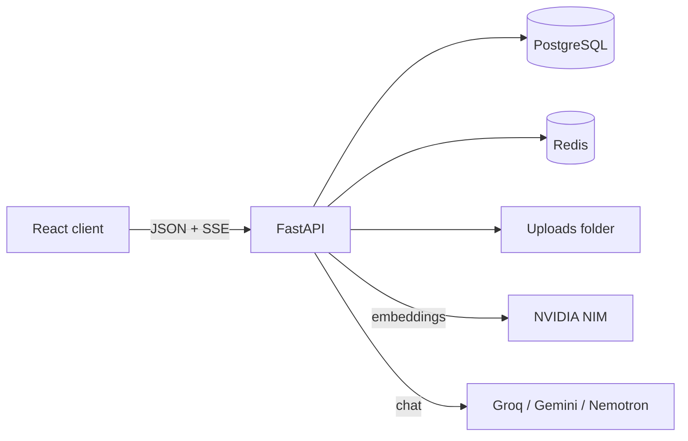

# PDF Chat AI

Upload PDFs and ask questions about them. Answers stream in as they are written and cite the pages they came from.

PDF Chat AI is a full-stack Retrieval-Augmented Generation (RAG) app built with **React** and **FastAPI**. Each PDF is indexed in the background. When you ask a question, only the most relevant passages are sent to an LLM. Three free model providers (Groq, Google Gemini, NVIDIA Nemotron) are wired in, and if one is busy the next takes over.

> Status: in progress. The core features work end to end; see [Roadmap](#roadmap).

## Features

- **Chat with one or more PDFs**, with answers that cite page numbers, e.g. "(page 42)".
- **Streaming answers** over Server-Sent Events.
- **Background indexing** with a live 0–100% progress bar: text extraction → chunking → embeddings.
- **Whole-document summaries**: long documents are summarized section by section, so "summarize this book" works even for long PDFs.
- **Smart model switching**: a local heuristic sends simple questions to Groq, explanations to Gemini Flash and analysis to Nemotron Super. You can turn it off and pick a model yourself.
- **Automatic fallback**: if a model fails or is rate-limited, the next one in the chain answers. Provider health is shown in the UI.
- **Auth**: JWT access tokens, a refresh token in an httpOnly cookie, and logout that really revokes tokens (Redis blacklist).
- **Hardening**: per-user rate limits, security headers, a strict CORS allowlist, and ownership checks on every query.
- **Redis caching** that falls back to Postgres if Redis is down.
- Built-in PDF viewer, chat history, onboarding, profile and settings pages.

## Tech stack

| Layer | Technologies |
| --- | --- |
| Frontend | React 19, Vite, Redux Toolkit, React Router, Tailwind CSS, Axios, react-markdown |
| Backend | FastAPI (async), SQLAlchemy 2 (asyncio), Pydantic, Alembic |
| Database | PostgreSQL (asyncpg) |
| Cache / limits | Redis |
| AI | litellm → Groq (`gpt-oss-20b`), Gemini Flash, NVIDIA Nemotron Super; NVIDIA NIM embeddings (`nemotron-3-embed-1b`) |
| PDF / vectors | pypdf, numpy |
| Tests | pytest, pytest-asyncio |

## How it works



**Upload.** `POST /pdfs/upload` validates and saves the file, then returns right away. A background task extracts text per page, splits it into ~1,000-character chunks with 200 characters of overlap (keeping page numbers), and embeds them in batches. Finally it writes a document summary.

**Ask.** The question is embedded and compared with every chunk of the chat's PDFs using cosine similarity. The top 8 chunks, labelled with file name and page, go into the prompt. Questions about the whole document ("what is this book about?") use the stored summary instead.

**Why numpy instead of pgvector?** The embedding model returns 2048-dimensional vectors, which is over pgvector's 2000-dimension index limit. Vectors are L2-normalized and stored as packed float32 bytes, so similarity search is a single matrix multiply.

## Project structure

```
├── client/                  # React + Vite frontend
│   └── src/
│       ├── api/             # axios instance (token refresh), SSE stream reader
│       ├── components/      # chat, sidebar, layout, common UI
│       ├── features/        # Redux Toolkit slices
│       ├── hooks/           # useAuth, useChat, usePdfStatus
│       ├── pages/           # Login, Signup, Dashboard, Settings...
│       └── routes/
└── server/                  # FastAPI backend
    ├── alembic/             # database migrations
    ├── app/
    │   ├── core/            # security, Redis, cache, rate limits, headers
    │   ├── models/          # SQLAlchemy models
    │   ├── routers/         # auth, users, chats, messages, pdfs, models
    │   ├── schemas/         # Pydantic schemas
    │   └── services/        # chunking, embeddings, retrieval, AI, model router
    ├── tests/
    └── SECURITY.md
```

## Getting started

### Prerequisites

- Python 3.11+
- Node.js 20+
- PostgreSQL 14+
- Redis (optional: the app runs without it, but has no caching, rate limits or token revocation)
- API keys for at least one of: [Groq](https://console.groq.com), [Google AI Studio](https://aistudio.google.com), [NVIDIA NIM](https://build.nvidia.com). The NVIDIA key also powers embeddings; without it, answers fall back to the raw document text instead of search.

### 1. Backend

```bash
cd server
python -m venv venv
source venv/bin/activate        # Windows: venv\Scripts\activate
pip install -r requirements.txt

cp .env.example .env            # then fill in DATABASE_URL, JWT_SECRET_KEY and API keys
createdb pdf_chat_ai            # or create the database in pgAdmin/psql

uvicorn app.main:app --reload
```

Database migrations run automatically on startup. The API runs at `http://localhost:8000`, with interactive docs at `http://localhost:8000/docs`.

### 2. Frontend

```bash
cd client
npm install
npm run dev
```

Open `http://localhost:5173`. To point the client at a different API, set `VITE_API_BASE_URL` (default: `http://localhost:8000/api/v1`).

### Environment variables

| Variable | Purpose |
| --- | --- |
| `DATABASE_URL` | PostgreSQL connection string (`postgresql+asyncpg://...`) |
| `REDIS_URL` | Redis connection string |
| `JWT_SECRET_KEY` | Secret used to sign JWTs; use a long random value |
| `GROQ_API_KEY` | Groq models |
| `GOOGLE_API_KEY` | Gemini models |
| `NEMOTRON_API_KEY` | NVIDIA Nemotron LLM and embeddings |
| `ALLOWED_ORIGINS` | Frontend origins allowed by CORS |
| `MAX_PDF_SIZE_MB` | Upload size limit (default 50) |

See [`server/.env.example`](server/.env.example) for the full list.

## API overview

All routes are prefixed with `/api/v1`. Full details are at `/docs`.

| Area | Endpoints |
| --- | --- |
| Auth | `POST /auth/register`, `/auth/login`, `/auth/refresh`, `/auth/logout` |
| Users | `GET/PATCH/DELETE /users/me`, `PATCH /users/me/onboarding` |
| PDFs | `POST /pdfs/upload`, `GET /pdfs`, `GET /pdfs/{id}`, `GET /pdfs/{id}/view`, `DELETE /pdfs/{id}` |
| Chats | `GET/POST /chats`, `GET/PATCH/DELETE /chats/{id}`, `POST /chats/{id}/pdfs` |
| Messages | `GET /chats/{id}/messages`, `POST /chats/{id}/messages`, `POST /chats/{id}/messages/stream` (SSE) |
| Models | `GET /models`, `GET /models/health` |

## Running tests

```bash
cd server
pytest
```

Tests create a throwaway `<your db>_test` database and a temporary upload folder, so your development data is never touched. PostgreSQL must be running.

## Security

Security choices and pre-deployment steps are documented in [`server/SECURITY.md`](server/SECURITY.md). Before deploying: serve over HTTPS, set `DEBUG=False` and `COOKIE_SECURE=True`, rotate `JWT_SECRET_KEY`, and restrict `ALLOWED_ORIGINS`.

## Roadmap

- [ ] Deploy with Docker behind HTTPS
- [ ] OCR for scanned PDFs
- [ ] Hybrid search (keyword + vector) with reranking
- [ ] pgvector HNSW index with a ≤2000-dimension embedding model
- [ ] Dedicated job queue (Celery / arq) for background processing
- [ ] Object storage (S3) for uploaded files
- [ ] Email verification and password reset

## Author

**Aayush Bhadula**: [GitHub](https://github.com/aayush-a27)
