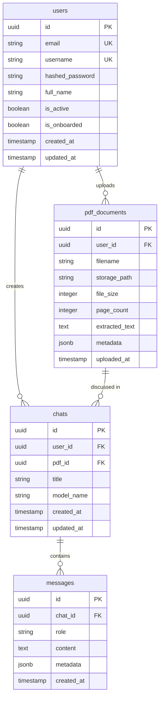

# PDF Chat AI — Full-Stack Setup Plan

A full-stack application where users upload PDFs and chat with an AI that uses the PDF content as context. Built with **React + Tailwind** (frontend), **FastAPI + Pydantic** (backend), **PostgreSQL** (primary DB), and **Redis** (caching/sessions).

---

## Database Recommendation

> [!IMPORTANT]
> **PostgreSQL** is the recommended primary database for this project. Here's why:
>
> | Database    | Read Speed | Write Speed | PDF Metadata | Full-Text Search | JSON Support | Best For |
> |------------|------------|-------------|--------------|------------------|--------------|----------|
> | **PostgreSQL** | ★★★★☆ | ★★★★☆ | ✅ Excellent | ✅ Built-in `tsvector` | ✅ `JSONB` | Structured data + search |
> | MongoDB    | ★★★★☆ | ★★★★★ | ✅ Good | ⚠️ Atlas Search | ✅ Native | Document-heavy apps |
> | MySQL      | ★★★★☆ | ★★★☆☆ | ⚠️ Okay | ⚠️ Basic | ⚠️ Limited | Simple CRUD |
>
> **PostgreSQL wins** because:
> 1. **pgvector extension** — native vector similarity search for AI/RAG embeddings (critical for your PDF Q&A feature)
> 2. **JSONB** — store flexible chat metadata without schema migration headaches
> 3. **Full-text search** — search within PDF extracted text natively
> 4. **ACID compliant** — reliable for user data, chat history, auth tokens
> 5. **Async support** — `asyncpg` is one of the fastest Python DB drivers, pairs perfectly with FastAPI

> [!NOTE]
> **Redis** will be used alongside PostgreSQL for:
> - Session management & JWT token blacklisting
> - Caching frequently accessed chat histories
> - Rate limiting API requests
> - Real-time pub/sub for streaming AI responses
>
> **Redux Toolkit** will be used on the frontend for:
> - Global auth state management
> - Chat history state
> - Model selection state
> - PDF upload status tracking

---

## User Review Required

> [!WARNING]
> **Tailwind CSS Version**: You requested Tailwind. I'll install **Tailwind CSS v4** (latest) which uses the new CSS-first configuration approach (no `tailwind.config.js`). If you prefer v3 (traditional config file approach), let me know.

> [!IMPORTANT]
> **Encryption Strategy**: You mentioned encrypting request/response data. I'll implement:
> - **AES-256-GCM** encryption for request/response payloads using the `cryptography` library (Python) and `Web Crypto API` (browser-native, zero dependencies)
> - **bcrypt** for password hashing (via `passlib`)
> - **JWT (RS256)** for auth tokens using asymmetric keys
> - Data is encrypted in transit (payload-level), NOT in the database (as you specified)
> 
> This means every API response body will be AES-encrypted and the frontend will decrypt it. Same for requests. Is this the level of encryption you want, or do you also want HTTPS-only (TLS) which is simpler?

---

## Open Questions

1. **AI Model Provider**: Which AI/LLM do you want to use for the PDF chat? (OpenAI GPT-4, Google Gemini, Anthropic Claude, or a local model via Ollama?) This affects the "Model Selection" page on the LHS.
2. **Onboarding Flow**: What should the onboarding page contain? (e.g., tutorial walkthrough, profile setup, first PDF upload prompt?)
3. **Multi-PDF Support**: Can a user upload multiple PDFs and switch between them, or is it one PDF per chat session?
4. **File Size Limit**: What's the max PDF size you want to support? (This affects chunking strategy and storage decisions.)

---

## Proposed Changes

### 1. Frontend — React + Tailwind + Redux

#### Folder Structure
```
client/src/
├── api/                      # Axios instance, interceptors, encryption
│   ├── axiosInstance.js       # Base axios config + encryption middleware
│   └── endpoints.js           # API endpoint constants
├── app/
│   └── store.js               # Redux store configuration
├── assets/
│   └── icons/                 # SVG icons
├── components/
│   ├── common/                # Reusable UI components
│   │   ├── Button.jsx
│   │   ├── Input.jsx
│   │   ├── Modal.jsx
│   │   ├── Loader.jsx
│   │   └── Avatar.jsx
│   ├── chat/
│   │   ├── ChatArea.jsx       # Main chat messages area
│   │   ├── ChatInput.jsx      # Message input with send button
│   │   ├── ChatBubble.jsx     # Individual message bubble
│   │   └── PdfUploader.jsx    # PDF upload dropzone
│   ├── sidebar/
│   │   ├── LeftSidebar.jsx    # Model selection + Profile + Settings
│   │   ├── RightSidebar.jsx   # Chat history list
│   │   ├── ModelSelector.jsx  # AI model selection dropdown
│   │   └── ChatHistoryItem.jsx
│   └── layout/
│       ├── AppLayout.jsx      # Main 3-column layout wrapper
│       ├── AuthLayout.jsx     # Layout for login/signup pages
│       └── Navbar.jsx
├── features/                  # Redux slices
│   ├── auth/
│   │   └── authSlice.js       # Login, logout, token management
│   ├── chat/
│   │   └── chatSlice.js       # Messages, active chat, streaming
│   ├── pdf/
│   │   └── pdfSlice.js        # Upload status, active PDF
│   └── ui/
│       └── uiSlice.js         # Sidebar toggles, theme, modals
├── hooks/                     # Custom React hooks
│   ├── useAuth.js
│   ├── useChat.js
│   └── useEncryption.js       # Web Crypto API encryption/decryption
├── pages/
│   ├── Login.jsx
│   ├── Signup.jsx
│   ├── Onboarding.jsx
│   ├── Dashboard.jsx          # Main chat page (3-column layout)
│   ├── Profile.jsx
│   ├── Settings.jsx
│   └── NotFound.jsx
├── routes/
│   ├── AppRoutes.jsx          # Route definitions
│   └── ProtectedRoute.jsx     # Auth guard wrapper
├── utils/
│   ├── constants.js
│   └── helpers.js
├── App.jsx                    # Root component with router
├── index.css                  # Tailwind directives + custom theme
└── main.jsx                   # Entry point with Redux Provider
```

#### Key Frontend Files

##### [NEW] [index.css](file:///c:/GitLab/FullstackLearning--React-and-FastApi-/client/src/index.css) (overwrite)
- Tailwind v4 CSS-first imports (`@import "tailwindcss"`)
- Custom `@theme` block with dark green/black palette:
  - `--color-primary-50` through `--color-primary-950` (green shades)
  - Radial gradient background: light green center → dark green → black edges
- Custom utility classes for glassmorphism effects

##### [NEW] [App.jsx](file:///c:/GitLab/FullstackLearning--React-and-FastApi-/client/src/App.jsx) (overwrite)
- BrowserRouter wrapping AppRoutes
- Redux Provider wrapping everything

##### [NEW] Pages: Login, Signup, Onboarding, Dashboard, Profile, Settings, NotFound
- Each page as a standalone component
- Auth pages use `AuthLayout` (centered card on gradient background)
- Dashboard uses `AppLayout` (3-column: LHS sidebar | Chat area | RHS history)

##### [NEW] Redux Store + Slices
- `authSlice` — user info, tokens, isAuthenticated
- `chatSlice` — messages array, activeChatId, isStreaming
- `pdfSlice` — uploadProgress, activePdf, pdfList
- `uiSlice` — sidebar visibility, modal states

---

### 2. Backend — FastAPI + Pydantic

#### Folder Structure
```
server/
├── app/
│   ├── __init__.py
│   ├── main.py                # FastAPI app factory, CORS, middleware
│   ├── config.py              # Settings via pydantic-settings (env vars)
│   ├── database.py            # Async SQLAlchemy engine + session
│   ├── dependencies.py        # Dependency injection (get_db, get_current_user)
│   │
│   ├── models/                # SQLAlchemy ORM models
│   │   ├── __init__.py
│   │   ├── user.py
│   │   ├── chat.py
│   │   ├── message.py
│   │   └── pdf_document.py
│   │
│   ├── schemas/               # Pydantic request/response schemas
│   │   ├── __init__.py
│   │   ├── user.py
│   │   ├── auth.py
│   │   ├── chat.py
│   │   ├── message.py
│   │   └── pdf.py
│   │
│   ├── routers/               # API route handlers
│   │   ├── __init__.py
│   │   ├── auth.py            # POST /auth/login, /auth/register, /auth/logout
│   │   ├── users.py           # GET /users/me, PATCH /users/me, profile
│   │   ├── chats.py           # CRUD for chat sessions
│   │   ├── messages.py        # POST /messages (send + get AI response)
│   │   └── pdfs.py            # POST /pdfs/upload, GET /pdfs
│   │
│   ├── services/              # Business logic layer
│   │   ├── __init__.py
│   │   ├── auth_service.py    # JWT creation, password hashing, token refresh
│   │   ├── chat_service.py    # Chat session management
│   │   ├── pdf_service.py     # PDF parsing, text extraction, chunking
│   │   ├── ai_service.py      # LLM integration, RAG pipeline
│   │   └── encryption_service.py  # AES-256-GCM encrypt/decrypt
│   │
│   ├── middleware/
│   │   ├── __init__.py
│   │   └── encryption.py      # Request decryption / response encryption middleware
│   │
│   ├── core/
│   │   ├── __init__.py
│   │   ├── security.py        # Password hashing (bcrypt), JWT utils
│   │   └── redis.py           # Redis connection + helper functions
│   │
│   └── utils/
│       ├── __init__.py
│       └── helpers.py
│
├── alembic/                   # Database migrations
│   ├── env.py
│   └── versions/
│
├── alembic.ini
├── requirements.txt
└── .env.example
```

#### Key Backend Files

##### [MODIFY] [main.py](file:///c:/GitLab/FullstackLearning--React-and-FastApi-/server/app/main.py)
- FastAPI app with lifespan (startup: connect DB + Redis, shutdown: close)
- CORS middleware configured for React dev server
- Include all routers with `/api/v1` prefix
- Encryption middleware for req/res payload encryption

##### [NEW] config.py
- `pydantic-settings` based config reading from `.env`
- DB URL, Redis URL, JWT secret, AES key, allowed origins

##### [NEW] database.py
- Async SQLAlchemy setup with `asyncpg` driver
- Session factory with `async_sessionmaker`
- Base model class

##### [NEW] Routers: auth, users, chats, messages, pdfs
- All routes use Pydantic schemas for validation
- Dependency injection for DB sessions and auth
- Proper HTTP status codes and error handling

##### [NEW] Encryption middleware
- Uses `cryptography` library (Fernet or AES-256-GCM)
- Middleware intercepts requests → decrypts body
- Middleware intercepts responses → encrypts body
- Auth endpoints excluded from encryption initially

##### [NEW] requirements.txt
```
fastapi[standard]
uvicorn[standard]
sqlalchemy[asyncio]
asyncpg
pydantic-settings
python-jose[cryptography]
passlib[bcrypt]
cryptography
redis[hiredis]
python-multipart
alembic
```

---

### 3. Database — PostgreSQL + Redis

#### PostgreSQL Schema (via SQLAlchemy models)



#### Redis Usage Plan
| Key Pattern | Purpose | TTL |
|------------|---------|-----|
| `session:{user_id}` | Active JWT session tracking | 24h |
| `blacklist:{jti}` | Revoked JWT tokens (logout) | matches token expiry |
| `chat_cache:{chat_id}` | Cached recent chat messages | 1h |
| `rate_limit:{user_id}` | API rate limiting counter | 1min |
| `pdf_processing:{pdf_id}` | PDF processing job status | 30min |

---

## Installation & New Dependencies

### Frontend (npm)
```bash
# In client/
npm install tailwindcss @tailwindcss/vite                     # Tailwind v4
npm install react-router-dom                                    # Routing
npm install @reduxjs/toolkit react-redux                        # Redux
npm install axios                                               # HTTP client
npm install react-dropzone                                      # PDF upload dropzone
npm install react-hot-toast                                     # Toast notifications
npm install lucide-react                                        # Icon library
npm install react-markdown                                      # Render AI markdown responses
```

### Backend (pip)
```bash
# In server/
pip install fastapi[standard] uvicorn[standard]
pip install sqlalchemy[asyncio] asyncpg
pip install pydantic-settings
pip install python-jose[cryptography] passlib[bcrypt]
pip install cryptography
pip install redis[hiredis]
pip install python-multipart
pip install alembic
```

---

## Verification Plan

### Automated Tests
1. **Frontend**: Run `npm run dev` in `client/` — verify app loads with gradient background, all routes navigate correctly
2. **Backend**: Run `uvicorn app.main:app --reload` in `server/` — verify `/docs` loads with all API routes listed
3. **Lint**: Run `npm run lint` in `client/` to catch issues

### Manual Verification
1. Visit each frontend page (Login, Signup, Dashboard, etc.) and verify dark green/black radial gradient renders correctly
2. Verify 3-column layout on Dashboard page
3. Hit backend health endpoint to confirm server is running
4. Verify CORS works between frontend (port 5173) and backend (port 8000)
